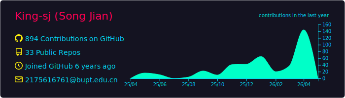
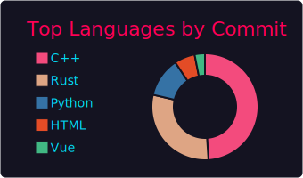
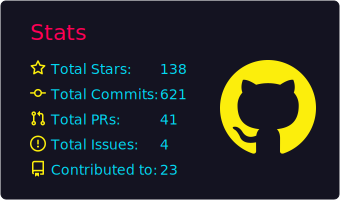
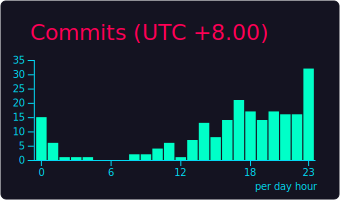

<h3 align="center">
Hi, I'm King-sj — coder, cpp enthusiast

</h3>

`Simple but not simplistic, with both code and fun.`

**Cards**

	
	 
	<em style="color:gray">Profile — quick facts and links</em>

	
	 
	<em style="color:gray">Languages — what I code in most</em>
	  
	
	 
	<em style="color:gray">Commit habits — languages used in commits</em>

	
	 
	<em style="color:gray">Stats — stars, forks, commits</em>
	  
	
	 
	<em style="color:gray">Productive time — displayed in UTC+8</em>

**About me**

- **Location**: Beijing (UTC+8)
- **Focus**: Backend, automation, occasional frontend debugging with dramatic flair
- **Hobbies**: reading novels, mathematics, gaming

**Quick links**
- 🌐 Website: https://bupt.online
- 📂 Repo: https://github.com/King-sj/King-sj

*If you like what you see, give this repo a star! Your support fuels my coding adventures and keeps the fun going. Thanks for stopping by! ⭐*

`I am not a bot, but I build them. One script can change the world — or at least this README.`