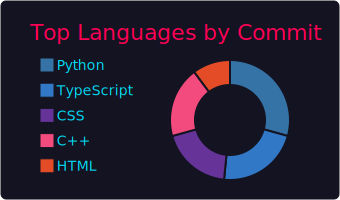

# Hi there, I'm King-sj 👋

### 💻 Coder • 🚀 C++ Enthusiast • 🌟 Problem Solver

*Simple but not simplistic, with both code and fun.*

### 🔗 Quick Links

  
  

## 📊 GitHub Stats

### Profile Overview

### 📈 Development Analytics

<table>
<tr>
<td width="50%">

**Languages Distribution**

</td>
<td width="50%">

**Commit Language Stats**

</td>
</tr>
</table>

### 🚀 Performance Metrics

<table>
<tr>
<td width="50%">

**GitHub Statistics**

</td>
<td width="50%">

**Productivity Timeline**

</td>
</tr>
</table>

## 🙋‍♂️ About Me

| 🌍 **Location** | 🎯 **Focus** | 🎨 **Hobbies** |
|:---:|:---:|:---:|
| Beijing (UTC+8) | Backend, Automation | Reading, Mathematics |
| 🏢 | Frontend Debugging | Gaming |

### 🛠️ What I Do
> Backend development, automation solutions, and occasional frontend debugging with dramatic flair

---

### 💝 Show Some Love

*If you like what you see, give this repo a star! Your support fuels my coding adventures and keeps the fun going.*

  
  

### 🤖 Fun Fact
> *"I am not a bot, but I build them. One script can change the world — or at least this README."*

**Thanks for stopping by!** ⭐

